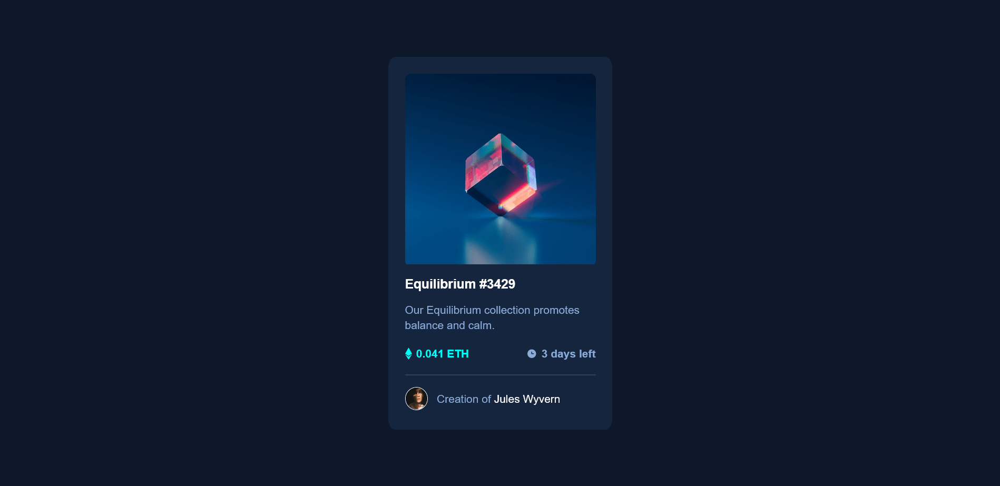

# Frontend Mentor - NFT preview card component solution

This is a solution to the [NFT preview card component challenge on Frontend Mentor](https://www.frontendmentor.io/challenges/nft-preview-card-component-SbdUL_w0U). Frontend Mentor challenges help you improve your coding skills by building realistic projects. 

## Table of contents

- [Overview](#overview)
  - [The challenge](#the-challenge)
  - [Screenshot](#screenshot)
  - [Links](#links)
  - [Built with](#built-with)
  - [Author](#author)

## Overview

### The challenge

Users should be able to:

- View the optimal layout depending on their device's screen size
- See hover states for interactive elements

### Screenshot

### Links

- Solution URL: [NFT Preview Card ↗](https://www.frontendmentor.io/solutions/nft-preview-card-component-html-css-4KZbCYeozW)
- Live Site URL: [Link ↗](https://your-live-site-url.com)

### Built with

- Semantic HTML5 markup
- CSS custom properties
- Flexbox
- Mobile-first workflow

### Author

- Website - [Link ↗](https://itsdevdeepak.github.io/nft-preview-card-component/)
- Frontend Mentor - [@itsdevdeepak ↗](https://www.frontendmentor.io/profile/itsdevdeepak)
- Twitter - [@itsdevdeepak ↗](https://www.twitter.com/itsdevdeepak)
